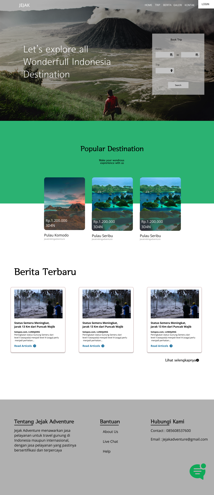
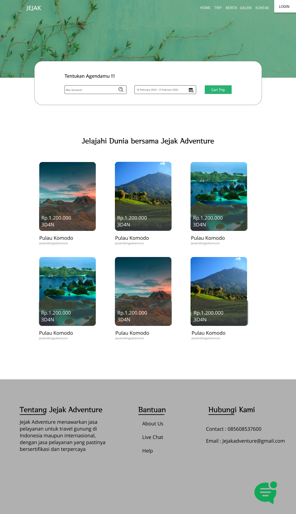
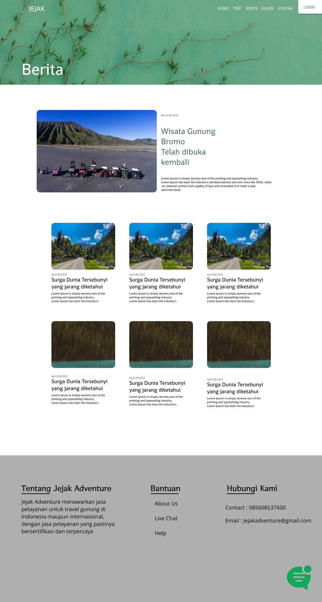

# JEJAK ADVENTURE

Jejak Adventure merupakan sebuah platfrom yang membantu para customer yang ingin berlibur menggunakan travel agent berbasis website. Jejak adventure menampung para travel agent yang ingin bergabung dan memasarkan trip mereka. Fitur lainya yaitu dapat membaca berita terkait wisata.

Tampilan Utama                              | Tampilan Kata                              | Tampilan Praktik
--------------------------------------------|--------------------------------------------|--------------------------------------------
||

### Link Berkas PA

https://drive.google.com/drive/folders/107rfp-XcWU5MiE09E06nIJTniT3HGFLc?usp=sharing

### Susunan Tim

Nama            | Username Github | Posisi
----------------|-----------------|-----------
Bagus Pahlefi   | baguspahlefi2000| Mahasiswa
Rifqi Luthfian  | rifqiluthfian   | Mahasiswa
Dahliar Ananda  | dahliar         | Pembimbing
Indra Azimi     | indraazimi      | Reviewer
